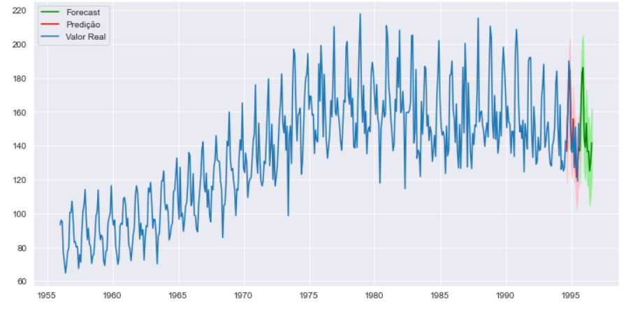
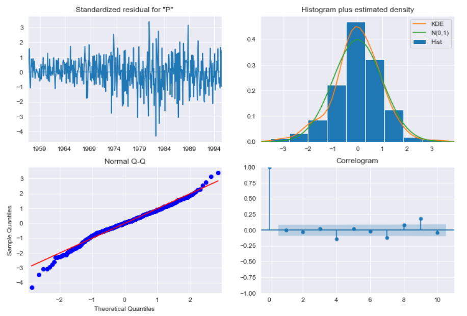

#  Análise de Série Temporal e Forecasting de Dados em Python

## Contexto

Este projeto explora os dados relacionados à produção de Cerveja na Austrália e fornece previsões baseadas em alguns modelos utilizados para a realização do Casting nos dados, como ARIMA e LSTM. Possui dados de uma única série temporal com frequência mensal, representando a produção total de cerveja australiana em megalitros durante o período de janeiro de 1956 a agosto de 1995. Nas primeiras etapas, realizo a leitura e a preparação dos dados, em seguida uma breve Análise dos Dados (EDA). O primeiro passo é traçar a série temporal e observar quaisquer características típicas, portanto, uma maneira de representar uma série temporal é assumir que o processo estocástico pode ser representado como uma combinação de componentes de tendência, sazonalidade e componentes cíclicos. Dessa forma, tentamos quebrar a série nesses componentes, a fim de escolher qual modelo teria melhor desempenho em termos de previsão.

## Bibliotecas utilizadas

Projeto desenvolvido em Python e suas principais bibliotecas, Pandas, Plotly, Matplotlib, Pandas Profiling, Numpy, Seaborn, Sklearn, Math, Pmdarima e Statsmodels.

## Etapas Realizadas:

* **- Importação da base de dados:**  Nessa etapa é onde realizamos a importação da nossa base de dados que será analisada posteriormente.
* **- Preparação e Limpeza dos dados:** Sabemos que nem todos os dados coletados serão úteis, então é nessa etapa que precisaremos limpá-los. Este processo é onde removemos os registros que são nulos, registros duplicados e erros básicos. A limpeza dos dados é obrigatória antes de enviar as informações para análise.
* **- Análise Exploratória/Série Temporal:** Essa é uma das etapas mais importantes, pois é onde vamos analisar cada característica da base de dados e de cada variável.
* **- Forecasting dos dados:** É onde aplica-se técnicas para encontrar padrões e tendências para tentar prever eventos futuros, com base no histórico de dados no tempo. 

## Exemplos de Visualização dos Dados

>

>

